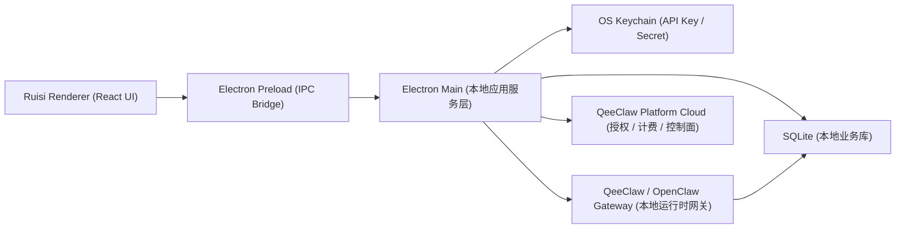

# Ruisi 本地优先技术方案

## 1. 文档目标

这份文档用于明确 `qeeshu-ruisi` 最终走向桌面产品后的整体技术形态。

当前要解决的核心问题不是“要不要再做一个远程后端”，而是：

- `ruisi` 作为 Electron 桌面应用，是否需要一个本地服务层
- 这层服务应该由谁承担
- `QeeClaw / OpenClaw Gateway` 与 `ruisi` 本地服务之间如何分工
- 哪些数据放本地，哪些能力保留在云端

## 2. 最终结论

### 2.1 结论一句话

`企数睿思` 不需要独立远程后端，但需要本地应用服务层；这层优先由 `Electron Main + Preload + SQLite + OS Keychain` 承担，而不是再单独做一个本地 HTTP 后端。

### 2.2 更完整的收口

- `ruisi` 不再新增独立 SaaS 后端
- 云端继续复用 `QeeClaw Platform`
- `Electron Main` 承担本地“后端式”职责
- `QeeClaw / OpenClaw Gateway` 继续承担本地运行时网关职责
- 业务数据本地优先
- 云端只保留控制面与计费面

## 3. 总体架构



## 4. 三层职责划分

### 4.1 Renderer 层

Renderer 是桌面应用的前端界面层，负责：

- 页面渲染
- 用户交互
- 本地数据展示
- 调用 `window.ruisi.*` 能力

Renderer 不直接负责：

- 保存 API Key
- 访问系统文件
- 直接连接数据库
- 直接控制本地 QeeClaw 进程

### 4.2 Electron Main 层

Electron Main 是 `ruisi` 的本地应用服务层，也可以理解成“本地后端”。

它负责：

- 安全存储 API Key
- 管理本地数据库
- 管理草稿、缓存、偏好、CRM、本地审计数据
- 检查和探测本地 QeeClaw 是否在线
- 通过 IPC 向前端暴露安全白名单接口
- 调用云端控制面接口
- 对接本地 QeeClaw 运行时
- 统一做错误处理、超时、重试、连接诊断

### 4.3 QeeClaw / OpenClaw Gateway 层

QeeClaw Gateway 继续做运行时网关，不被 `ruisi` 替代。

它负责：

- 微信插件与渠道桥接
- 本地知识目录监听
- 本地知识索引与运行时桥接
- 设备注册与设备在线态
- OpenClaw 运行时通信

它不应该承担：

- `ruisi` 的界面状态管理
- `ruisi` 的草稿与本地产品数据管理
- `ruisi` 的业务页面装配逻辑

### 4.4 云端 QeeClaw Platform 层

云端平台继续作为控制面存在，负责：

- API Key 发放与校验
- 钱包余额
- 充值记录
- token 用量汇总
- 授权控制
- 版本灰度与能力开关

如果未来仍使用云端模型路由，则云端还承担：

- 模型网关
- 统一计量
- provider 选择与额度控制

## 5. 为什么不建议再做一个本地 HTTP 后端

当前阶段不建议为 `ruisi` 再起一个额外的本地 Node/Python 服务，例如 `localhost:xxxx` 这种形式。

原因如下：

### 5.1 Electron Main 已经足够承担本地服务职责

Electron 自带：

- 主进程
- IPC
- 本地文件访问
- 子进程控制
- 系统通知
- 系统托盘
- 安全隔离能力

对于 `ruisi` 当前目标来说，已经足够。

### 5.2 额外本地服务会增加复杂度

如果再做一个本地 Node/Python 服务，会引入额外问题：

- 端口占用
- 进程管理
- 崩溃恢复
- 开机自启策略
- 安装包编排
- 本地升级与版本兼容
- 跨平台签名与权限

### 5.3 与现有 QeeClaw Gateway 的边界会变乱

本地已经有一个 `QeeClaw / OpenClaw Gateway`，如果 `ruisi` 再增加一个本地 HTTP 后端，很容易形成：

- 两个本地常驻进程
- 两套端口
- 两套进程监控
- 两套诊断路径

这会让交付、运维、排障都变复杂。

## 6. 什么时候才需要独立本地服务

只有在下面这些场景出现时，才建议把本地服务从 `Electron Main` 中拆出来：

- Electron 窗口关闭后，后台任务仍需长期运行
- 本地索引、解析、转码、向量化非常重
- 需要给多个本地客户端共享同一服务
- 要求本地服务独立升级，不随桌面端升级
- 需要独立的本地任务调度、守护与监控系统

在当前阶段，这些都不是第一优先级。

## 7. 数据分层原则

## 7.1 本地优先原则

本地优先的含义是：

- 用户业务数据优先保存在本机
- 用户隐私数据优先不上传云端
- 桌面产品可在弱网或断网时保持基础可用
- 云端只承担必要的授权与计费职责

## 7.2 本地保存的数据

以下数据建议本地保存：

- CRM 正式业务数据
- 会话记录
- 知识文件与知识元数据
- 本地审计日志明细
- 设备状态历史
- AI Writer 草稿
- 方法论配置
- 页面偏好与用户设置
- 本地缓存与离线快照

## 7.3 云端保存的数据

以下数据建议保留在云端：

- API Key 主记录
- 钱包余额
- 充值订单
- token 计量汇总
- 授权状态
- 版本控制与能力开关

## 7.4 一个必须明确的现实边界

如果 `ruisi` 仍然调用云端模型能力，那么：

- prompt
- 上下文
- 检索片段
- 部分会话内容

仍然可能经过云端。

因此“业务库本地化”与“内容完全不出本地”是两回事。

如果后续要做到“内容完全本地处理”，还需要满足：

- 本地检索
- 本地索引
- 本地推理
- 本地模型调用

## 8. 最终推荐的技术选型

### 8.1 桌面端

- Electron
- React
- Preload IPC

### 8.2 本地存储

- SQLite
- `better-sqlite3`
- `drizzle` 或 `kysely`

### 8.3 密钥存储

- macOS Keychain
- Windows Credential Manager
- 建议通过 `keytar`

### 8.4 本地运行时集成

- 继续接 `QeeClaw / OpenClaw Gateway`
- 不重写网关
- 由 Electron Main 做探测、诊断、编排

### 8.5 云端集成

- 继续接 `QeeClaw Platform`
- 仅调用授权、计费、控制面接口
- 如果后续保留云端模型路由，则继续复用现有平台模型网关

## 9. 建议的目录分层

建议未来 `qeeshu-ruisi` 逐步演化为以下结构：

```text
qeeshu-ruisi/
  src/                      # Renderer
  electron/
    main/                   # Electron main process
    preload/                # IPC bridge
    services/               # 本地服务层
    db/                     # SQLite schema / migrations / dao
    security/               # keychain / secret helpers
    qeeclaw/                # QeeClaw health / bridge / diagnostics
  docs/
```

## 10. 第一阶段最小落地范围

第一阶段不追求一次性做完整，而是先把最必要的本地服务层立起来。

建议第一阶段只做：

- Electron 壳
- Preload 安全桥
- API Key 写 Keychain
- SQLite 建库
- 本地保存：
  - 草稿
  - 偏好
  - 本地会话
  - CRM 基础表
- 本地探测 QeeClaw 在线态
- 云端拉取钱包与授权状态

## 11. 第二阶段能力扩展

第二阶段再逐步补齐：

- 知识库本地索引元数据管理
- 设备状态历史
- 本地审计日志
- 离线缓存
- 导入导出
- 自动诊断
- 与 QeeClaw 的更深层消息桥接

## 12. 对现有页面开发的直接影响

这套架构意味着：

- `Dashboard` 要逐步改为“SQLite + 本地运行时 + 云端控制面”的混合装配
- `Search` 的检索与追问能力要分为“本地知识索引”和“模型生成”两段
- `CRM` 要从前端推导视图升级为本地正式业务表
- `AI Writer` 要开始把草稿、区块、审计结果存入本地数据库
- `Settings` 要接入 Keychain、SQLite 和本地 QeeClaw 诊断

## 13. 最终收口

最终推荐架构不是：

- `ruisi + 独立远程后端`

也不是：

- `ruisi + 新本地 HTTP 服务 + QeeClaw Gateway`

而是：

- `ruisi Renderer`
- `Electron Main 作为本地后端`
- `QeeClaw Gateway 作为本地运行时网关`
- `QeeClaw Platform 作为云端控制面`

这是当前商业模式、交付模式和工程复杂度之间最平衡的一种方案。
